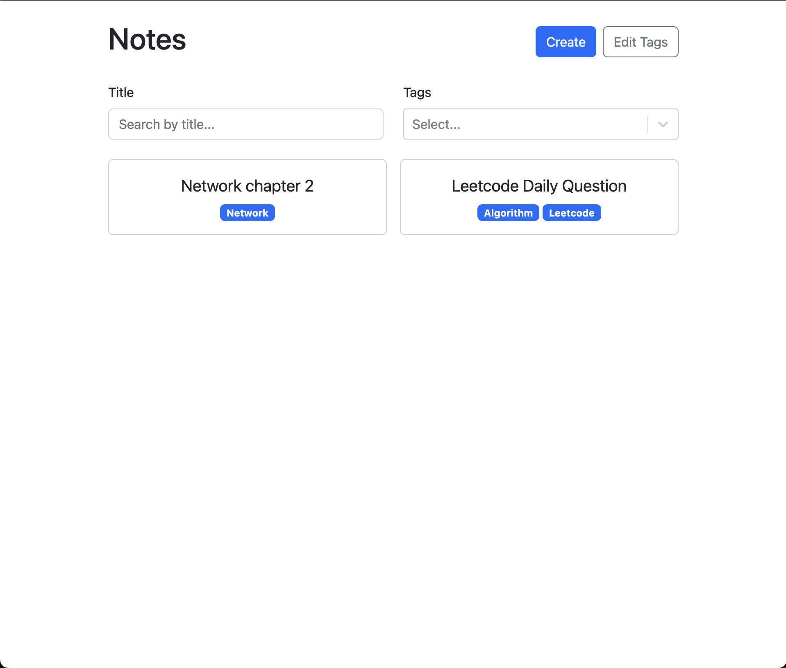
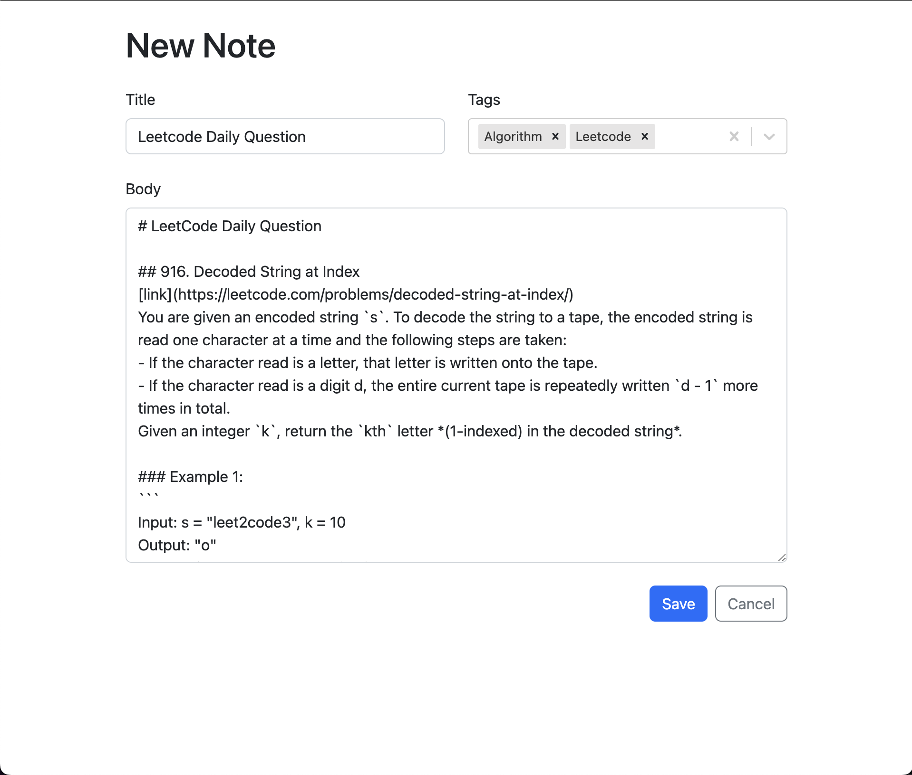
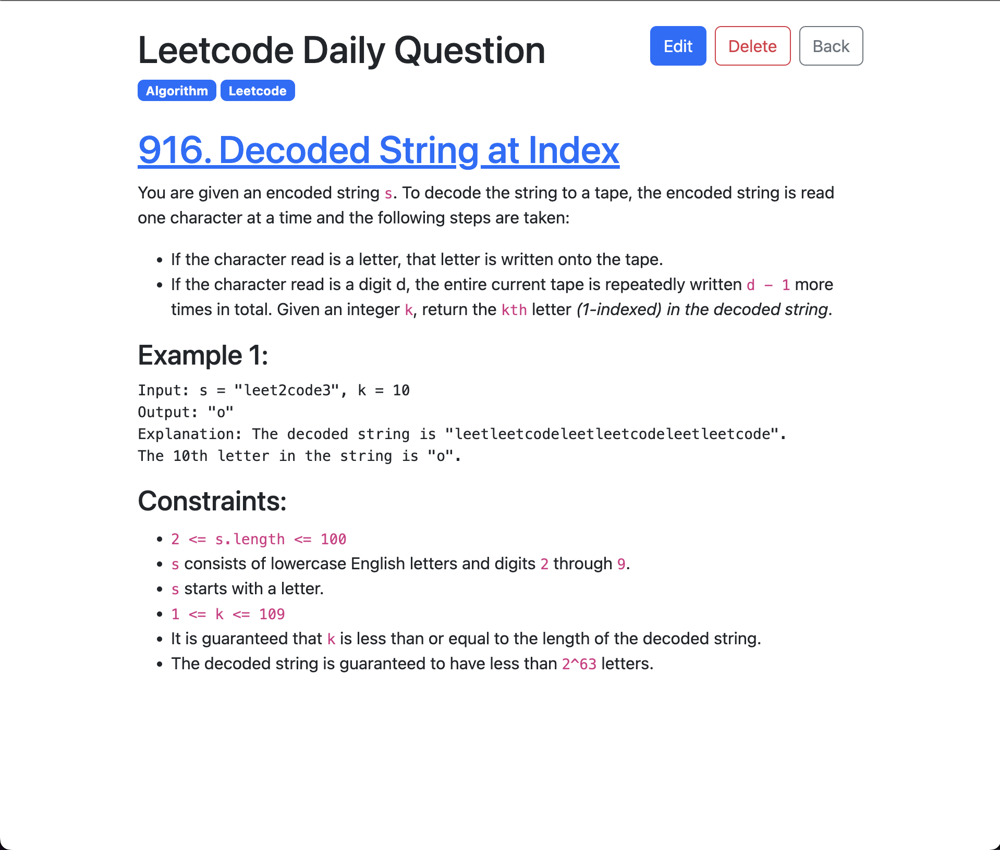

<h1 align="center">Markdown Note App | <a href="https://thecloer.github.io/markdown-note-app/">Website</a></h1>

A markdown note app using localStage. Manage your notes with tags and markdown.

## Usage

### Main Page

- Create a new note by clicking the `Create` button.
- Search for a note by typing in the search bar or selecting tags.
- Click on a note to view it.
- Edit tags

### Create Page

- Write a note in markdown.
- Add tags to the note.

### Note Page

- View and manage the note.

## Used

- Typescript
- Reactjs
- react-markdown
- LocalStorage
- Bootstrap
